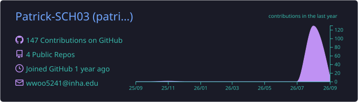
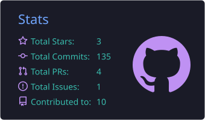
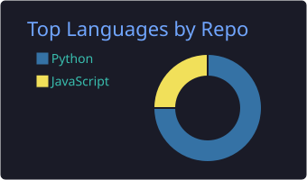
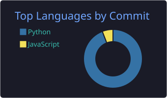
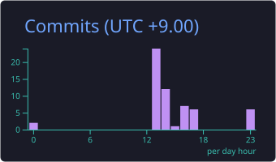

<!-- ① 헤더 배너 -->

<!-- ② 타이핑 애니메이션 -->

 

AI 에이전트와 자동화 도구 만들기를 좋아하는 인하대학교 컴퓨터공학과 학생입니다.

 

<!-- ⑦ 기술 스택 배지 -->
## 🛠️ Tech Stack

 

 

 

<!-- ③ 스탯 + 언어 카드 (GitHub Action이 매일 자동 생성) -->
## 📊 GitHub Stats

 

 

 

<!-- ⑩ 대표 프로젝트 -->
## 🚀 Featured Projects

| 프로젝트 | 소개 | 스택 |
|---|---|---|
| 💰 [**budget-book**](https://github.com/Patrick-SCH03/budget-book) | 나만의 가계부 웹앱 — 토스 TDS 스타일 단일 HTML | `HTML` `JS` |
| 🏃 [**MOVE-AI-CHALLENGE-2026**](https://github.com/Patrick-SCH03/MOVE-AI-CHALLENGE-2026) | MOVE AI 챌린지 2026 참가 프로젝트 | `Python` `JS` |
| 🤖 [**Student-Council_AI_Agent**](https://github.com/Patrick-SCH03/Student-Council_AI_Agent) | 학생회 업무 자동화 AI 에이전트 | `Python` `TS` |
| 🧱 [**project-template**](https://github.com/Patrick-SCH03/project-template) | 내 프로젝트 표준 템플릿 — 테스트 · CI · README 골격 | `HTML` `JS` |

 

<!-- ⑨ 컨트리뷰션 스네이크 -->
<picture>
  <source media="(prefers-color-scheme: dark)" srcset="https://raw.githubusercontent.com/Patrick-SCH03/Patrick-SCH03/output/github-contribution-grid-snake-dark.svg" />
  
</picture>

<!-- 푸터 배너 -->

